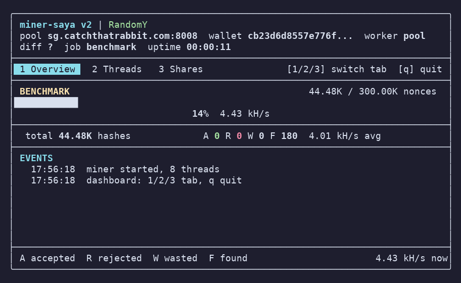
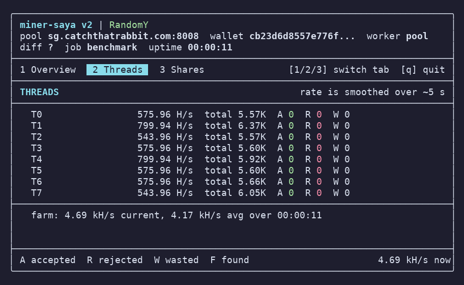
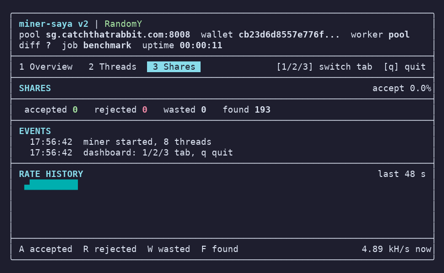

# xcb — Core Coin (XCB) RandomY Miner

[](https://github.com/ylxai/xcb-v2/actions/workflows/ci.yml)

Miner C++ pribadi untuk **Core Coin (XCB)** menggunakan algoritma **RandomY** (fork RandomX v1.2.1).
Dibangun dari nol — **zero dev fee**, dependensi eksternal hanya RandomY + FTXUI.

- **Zero dev fee** — semua hash 100% ke wallet yang dikonfigurasi, tidak ada switch wallet
- **ETHPROXY protocol** (`eth_submitLogin` / `eth_getWork` / `eth_submitWork`) untuk pool catchthatrabbit
- **Light mode** (256MB cache) atau **full mode** (264MB dataset), JIT compiler, huge pages auto-detect
- **CPU affinity + nice priority** — thread di-pin per core
- **Multi-pool config file** (`pool.cfg`) — failover otomatis antar server
- **Dashboard TUI (FTXUI)** — live stats interaktif, keyboard-driven (1/2/3 pindah tab, q quit)

---

## Docker Image

Image resmi di **Docker Hub**: [`ylxai/xcb`](https://hub.docker.com/r/ylxai/xcb)

```bash
docker pull ylxai/xcb:v1

# Jalankan cepat (env dari image default: wallet + pool sg)
docker run --rm ylxai/xcb:v1

# Jalankan dengan override penuh
docker run --rm -d --name xcb \
  -e WALLET=<alamat_wallet> \
  -e POOL=sg.catchthatrabbit.com:8008 \
  -e WORKER=myworker \
  -e THREADS=4 \
  ylxai/xcb:v1
```

> **Memori & huge pages: otomatis.** Miner membaca RAM tersedia (termasuk cgroup
> limit container) dan jumlah huge page bebas, lalu memilih sendiri: `FULL_MEM=1`
> kalau ada ≥3GB, `FULL_MEM=0` (light, ~256MB) kalau tidak; `LARGE_PAGES` hanya
> menyala kalau huge page-nya memang cukup. Pilihannya dicetak saat start:
> `[Config] auto FULL_MEM=0 (usable 512MB, ...)`.
> Set `-e FULL_MEM=1` atau `-e LARGE_PAGES=1` hanya kalau mau memaksa.

---

## Environment Variables

Semua env vars dibaca langsung (precedence ≥ config file & CLI):

| Variable | Default | Deskripsi |
|----------|---------|-----------|
| `WALLET` | *(dari image)* | Alamat wallet Core Coin (XCB) |
| `POOL` | `sg.catchthatrabbit.com:8008` | Host pool `host:port` |
| `WORKER` | `pool` | Nama worker (ditampilkan pool sebagai `wallet.worker`). `auto` = hostname mesin |
| `THREADS` | *(kosong)* | Jumlah thread. **Kosong = auto (jumlah CPU cores)** |
| `FULL_MEM` | *(auto)* | `1` = dataset full 264MB, `0`/`false` = light 256MB. Kosong = pilih otomatis dari RAM tersedia / cgroup limit (ambang 776MB) |
| `LARGE_PAGES` | *(auto)* | `1` = huge pages, `0`/`false` = memori biasa. Kosong = menyala hanya kalau huge page cukup |
| `LOG_SHARES` | *(false)* | `1` = print setiap share found/accepted (default quiet — pool difficulty rendah sangat noisy) |

---

## Build dari Source (Lokal)

### Persyaratan
- Linux x86_64 dengan **AES-NI + AVX2** (build memakai `-march=x86-64-v3`) atau aarch64 dengan crypto extensions
- CMake ≥ 3.10 (versi sistem yang lebih baru lebih baik — CMake ≥ 3.16 disarankan)
- Compiler C++17 (g++ ≥ 8 atau clang ≥ 7)
- OpenSSL dev headers (di-`find_package` oleh CMakeLists — wajib ada meski kode tidak memanggilnya)

### Build
```bash
git clone <url-repo> xcb
cd xcb
git submodule update --init --recursive   # Wajib: tarik RandomY + FTXUI

mkdir build && cd build
cmake .. -DCMAKE_BUILD_TYPE=Release
make -j$(nproc)
# Binary: build/xcb (stripped)
```

> Submodule **harus** di-init dulu sebelum `cmake ..` — kalau belum, CMake gagal
> dengan `RandomY not found` / `FTXUI not found`.

### Verifikasi Build
```bash
./build/xcb --selftest        # cek hash SHA3-512 vs vektor NIST/OpenSSL (30 cek)
./build/xcb --benchmark 10000 # smoke test tanpa pool, lalu Ctrl+C
```

### Proteksi Diri (Opsional, OFF default)

Build dengan anti-debugging + penyamaran proses:

```bash
cmake .. -DCMAKE_BUILD_TYPE=Release -DENABLE_SELF_DEFENSE=ON
make -j$(nproc)
```

Yang aktif di binary hasil build ini:

- **Deteksi debugger** — `TracerPid != 0` (strace/gdb sudah menempel) → proses
  keluar sebelum sempat membaca config/wallet dari memori.
- **Anti-dump** — `PR_SET_DUMPABLE=0` + `RLIMIT_CORE=0`: `/proc/<pid>/mem`
  dan `/proc/<pid>/environ` tidak bisa dibaca proses lain, tidak ada core file.
- **Anti-ptrace** — `PTRACE_TRACEME` dikunci: `strace -p <pid>` dan
  `gdb -p <pid>` ditolak kernel (`Operation not permitted`).
- **Title spoof (opsional)** — env `XCB_TITLE=nama` mengganti nama proses di
  `ps` (comm) dan menghapus cmdline asli (host/wallet/pool tidak terlihat):

```bash
XCB_TITLE=xd ./build/xcb -o pool:port -u wallet.worker
ps aux | grep xd   # proses tampil sebagai "xd", tanpa argumen
```

Catatan: proteksi ini menargetkan pengintaian tingkat userland. Kernel tetap
mengetahui prosesnya (root tetap bisa melihat/menghentikan). Build normal
(tanpa flag) tetap bersih dan tidak mengandung kode ini.

### Lab Studi Keamanan

- `labs/syscall-hook/` — hooking syscall: ptrace interceptor, seccomp user
  notification, LD_PRELOAD interposisi, kprobe tracefs (tanpa LKM).
- `labs/process-hide/` — menyembunyikan `/proc/<pid>` dari `ps`/`pgrep`/`ls`
  via LD_PRELOAD (interposisi `readdir`/`getdents64`). Batas tekniknya
  didokumentasikan di `labs/process-hide/README.md` — ini userland hiding,
  bukan stealth kernel.
- `labs/polymorphic/` — generator polymorphic binary: tiap run menghasilkan
  varian dengan sha256 berbeda tapi fungsi identik (enkripsi key stream acak
  + stub assembly yang di-generate ulang: register/body/counter/NOP berbeda).
- `labs/elfpack/` — ELF runtime packer gaya UPX untuk binary asli: mode
  static (in-memory loader assembly: mmap/decode/mprotect/auxv rewrite/jmp)
  dan mode dynamic (zlib + temp file + fork/execve, untuk xcb). xcb 830 KB
  -> 352 KB, output & selftest identik. Batas tekniknya di README lab.

`--selftest` wajib lolos sebelum mining: ia memverifikasi implementasi keccak
hot-path (`len%72==71` dan kasus edge lain yang pernah salah di picosha3).

---

## Cara Pakai (Local Binary)

```bash
./xcb                        # auto threads, lihat pool.cfg / env
./xcb -t 4                   # 4 thread
./xcb --light -t 1           # 1 thread light mode
./xcb -o pool.lain.com:8008 -u wallet.worker   # override pool+wallet
```

### Auto-setup hugepages: `./mine.sh`
Cek CPU/RAM, set `vm.nr_hugepages` + `vm.max_map_count`, beri izin mlock (setcap), lalu jalankan miner — tanpa perlu hafal command sysctl:

```bash
./mine.sh                 # full dataset, threads = semua core
./mine.sh --light         # hemat RAM (~256MB)
./mine.sh --persist       # tulis /etc/sysctl.d agar hugepages tetap setelah reboot
./mine.sh --benchmark 100000    # arg lain diteruskan ke miner
```

Idempotent: sysctl/setcap hanya dijalankan bila belum cukup. Butuh sudo sekali untuk sysctl & setcap.

### Konfigurasi `pool.cfg`
File `pool.cfg` (cwd, `/miner/pool.cfg`, atau `~/xcb/pool.cfg` — dicek otomatis) mendukung multi-server failover:

```ini
wallet=alamat_wallet_anda
worker=auto
server[1]=sg.catchthatrabbit.com
port[1]=8008
server[2]=hk.catchthatrabbit.com
port[2]=8008
server[3]=de.catchthatrabbit.com
port[3]=8008
threads=4
light=true
```

`worker=auto` memakai **hostname mesin** sebagai nama worker, jadi satu
`pool.cfg` bisa dipakai di beberapa mesin (devbox, VPS, laptop) tanpa diubah dan
tiap mesin tetap terlihat terpisah di dashboard pool. Wallet tidak terpengaruh.
Hostname dibersihkan dulu — hanya huruf/angka/`-`/`_`, dipotong di titik pertama
(`mesin.domain.tld` → `mesin`, karena titik adalah pemisah `wallet.worker`),
maksimal 32 char, dan jatuh ke `worker` bila tidak ada karakter yang sah. Nilai
`auto` juga berlaku lewat `WORKER=auto` maupun `-u wallet.auto`.

> Precedence: **env vars > pool.cfg > CLI flags**. `WALLET`+`POOL` env aktif = pool.cfg diabaikan.
> Commands flag: `-o host:port`, `-u wallet[.worker]`, `-p password`, `-t N`, `--light`, `--no-jit`, `--ui=MODE`, `-h`.

---

## Dashboard / UI Mode

Secara default di terminal (TTY) miner menampilkan **dashboard FTXUI** full-screen yang hidup:

| Tab Overview — benchmark progress + hashrate | Tab Threads — rate & share per worker |
|-----------------------------------------------|---------------------------------------|
|  |  |

| Tab Shares — statistik share + event + rate history |
|-----------------------------------------------------|
|  |

> Screenshot diambil dari mode `--benchmark` (tanpa pool). Di mode mining biasa,
> tab Overview menampilkan **sparkline hashrate live** (48 detik) alih-alih gauge benchmark.

**Keyboard:**

| Tombol | Aksi |
|--------|------|
| `1` | Tab **Overview** — hashrate cur/avg/best + sparkline + ringkasan |
| `2` | Tab **Threads** — hashrate & share per worker |
| `3` | Tab **Shares** — statistik share lengkap + event + rate history |
| `q` / `x` / `Esc` | Keluar (Ctrl+C juga berfungsi) |

**Mode via `--ui=`:**

| Mode | Kapan | Deskripsi |
|------|-------|-----------|
| `auto` *(default)* | TTY | FTXUI di terminal, log line jika bukan TTY (docker/CI) |
| `ftxui` | TTY | Paksa dashboard FTXUI |
| `ansi` | TTY | Dashboard ANSI sederhana (redraw in-place, tanpa keyboard) |
| `log` | di mana saja | Hanya log line (one-liner tiap 5s + detail tiap 60s) |

> Mode `auto` sudah aman untuk docker/CI: tanpa TTY otomatis jatuh ke log line,
> dan `LOG_FORMAT=json` menghasilkan satu baris JSON per sample untuk monitoring.

---

## Docker (Build Image Sendiri)

```bash
cd xcb
git submodule update --init --recursive
docker build -t ylxai/xcb:v1 .
docker run --rm ylxai/xcb:v1
```

Image docker **multi-stage** (builder → runtime ~32MB), jalan sebagai user non-root `miner`, entrypoint `./xcb`.
`pool.cfg` ikut di-copy ke `/miner/pool.cfg` sebagai fallback.

---

## Kubernetes / Akash

### Akash SDL
```yaml
version: "2.0"
services:
  service-1:
    image: ylxai/xcb:v1
    env:
      - WALLET=<alamat_wallet>
      - POOL=sg.catchthatrabbit.com:8008
      - WORKER=akash
      - THREADS=16        # harus ≤ cpu.units
      # FULL_MEM / LARGE_PAGES tidak perlu di-set: miner membaca memori
      # yang dialokasikan provider dan memilih light/full sendiri.
    expose:
      - port: 80
        as: 80
        to:
          - global: true
profiles:
  compute:
    service-1:
      resources:
        cpu:
          units: 16
        memory:
          size: 8Gi
        storage:
          - size: 5Gi
  placement:
    dcloud:
      pricing:
        service-1:
          denom: uact
          amount: 100000
deployment:
  service-1:
    dcloud:
      profile: service-1
      count: 1
```

> `expose` port 80 sebenarnya tidak dipakai (tidak ada web server) — boleh dihapus.

### Kubernetes (Deployment + Secret)
Contoh lengkap ada di [`k8s/deployment.yaml`](k8s/deployment.yaml):
```bash
kubectl create namespace mining
kubectl apply -f k8s/deployment.yaml
kubectl logs -n mining deploy/xcb-miner -f
```
Wallet disimpan sebagai **Secret** (tidak di-env image). **`THREADS` wajib = `limits.cpu`**
(default di kode = `nproc` NODE, bukan limit pod — salah set akan oversubscribe).

---

## Benchmark

| Thread | Mode | Hashrate | RAM |
|--------|------|----------|-----|
| 1 | Light | ~68 H/s | ~256MB |
| 2 | Light | ~122 H/s | ~256MB |
| 4 | Light | **~291 H/s** | ~256MB |
| 16 | Light | ~1.26 KH/s | ~256MB |
| 16 | **Full** | **~7.9 KH/s** | ~264MB |

>  Full mode ±6x hashrate light mode (diverifikasi di VPS 16 core, 8GB RAM).
>
>  RandomY bukan RandomX: `DATASET_BASE_SIZE` 256MiB + extra 8MiB, jadi dataset
>  penuh hanya 264MB — bukan 2.6GB seperti RandomX. Puncak pemakaian ada saat
>  init (dataset 264MB + cache 256MB hidup bersamaan, lalu cache dilepas):
>  terukur RSS 524MB, dan mode full masih jalan di cgroup 536MB. Setelah init
>  turun ke ~266MB. Jumlah thread tidak menambah RAM — scratchpad RandomY hanya
>  128KiB per VM.

---

## Optimasi untuk Mesin Sendiri

```bash
# Huge pages (2MB) — cukup pakai ./mine.sh (set sysctl + mlock otomatis):
#   ./mine.sh --persist     # sekalian tahan reboot
# Manual (kalau mau):
sudo sysctl vm.nr_hugepages=1280

# CPU performance governor
echo performance | sudo tee /sys/devices/system/cpu/cpu*/cpufreq/scaling_governor

# Realtime priority
sudo chrt -rr 1 ./xcb
```

---

## Logging

- **Non-TTY / `--ui=log`** — one-liner tiap 5 detik (`HR cur (avg) | A n R n W n | diff | pool | job`) + tabel detail tiap 60 detik
- **Shares accepted** — per-share jika `LOG_SHARES=1`, selain itu level debug
- **Rejected / wasted** — selalu ditampilkan (dengan alasan)
- **`LOG_FORMAT=json`** — satu objek JSON per baris (hashrate, A/R/W, diff, pool, job) untuk docker/CI
- **`LOG_LEVEL`** — `debug | info | warn | error` (default `info`)

---

## Troubleshooting

| Gejala | Penyebab | Solusi |
|--------|----------|--------|
| `cache alloc failed` | Huge pages / RAM tidak cukup **dan** `LARGE_PAGES`/`FULL_MEM` dipaksa via env | Lepas env-nya — auto-detect memilih light + tanpa huge pages sendiri |
| Crash `stoul` / `Config` gagal | Env var kosong (`-e THREADS=`) | Biarkan env kosong atau isi nilai valid — versi v1 sudah menangani string kosong |
| Cuma 1 thread padahal banyak core | Default kode lama `threads=1` | Set `THREADS=<n>` atau gunakan v1 (auto = semua cores) |
| Hashrate ~50% dari harapan | Auto-detect memilih light karena RAM < 3GB (lihat `[Config] auto FULL_MEM=0`) | Tambah RAM/limit, atau paksa `FULL_MEM=1` kalau yakin cukup |
| Worker stuck (0.0x H/s) | Core sibuk/di luar cpuset provider (CPU affinity) | Cek `lscpu`/`Cpus_allowed_list`; jalankan berkali atau kurangi THREADS |
| Build gagal `RandomY` tidak ditemukan | Submodule belum di-init | `git submodule update --init --recursive` |
| Log kapah (ribuan share/detik) | Pool difficulty rendah + log per-share | Default v1 quiet; aktifkan verbose hanya untuk debug (`LOG_SHARES=1`) |

---

## Struktur Proyek

```
xcb/
├── CMakeLists.txt           # Build system (-march=x86-64-v3 / armv8-a+crypto, -O3, LTO, stripped)
├── Dockerfile               # Multi-stage: builder → runtime ~32MB, user non-root
├── .github/workflows/ci.yml # CI GitHub Actions (glibc + Alpine/musl + docker image)
├── docs/
│   └── screenshots/         # Screenshot dashboard (README)
├── k8s/
│   └── deployment.yaml      # Deployment + Secret contoh
├── external/
│   ├── RandomY/             # RandomY library (submodule, BSD 3-Clause)
│   └── FTXUI/               # Terminal TUI library (submodule, MIT)
├── pool.cfg                 # Multi-server config (wallet + 3 pool failover)
└── src/
    ├── main.cpp             # Entrypoint + signal handler + selftest
    ├── Config.hpp/.cpp      # Config parser (env vars + file + CLI)
    ├── StratumClient.hpp/.cpp # ETHPROXY protocol client
    ├── Miner.hpp/.cpp       # Thread pool, VM management, mining loop
    ├── Stats.hpp/.cpp       # Telemetri: rolling hashrate, sparkline, summary, dashboard
    ├── Dashboard.hpp/.cpp   # TUI FTXUI full-screen (tab Overview/Threads/Shares)
    ├── Log.hpp/.cpp         # Logger thread-safe (level, warna, JSON)
    ├── Submitter.hpp/.cpp   # Async share submitter (bounded queue)
    └── Sha3_512.hpp/.cpp    # SHA3-512 keccak satu-blok (hot path 40B)
```

---

## Lisensi

Kode ini dilisensikan di bawah **MIT License** — lihat [LICENSE](LICENSE).
RandomY library © RandomX contributors — [BSD 3-Clause](external/RandomY/LICENSE).
FTXUI © ArthurSonzogni — [MIT](external/FTXUI/LICENSE).